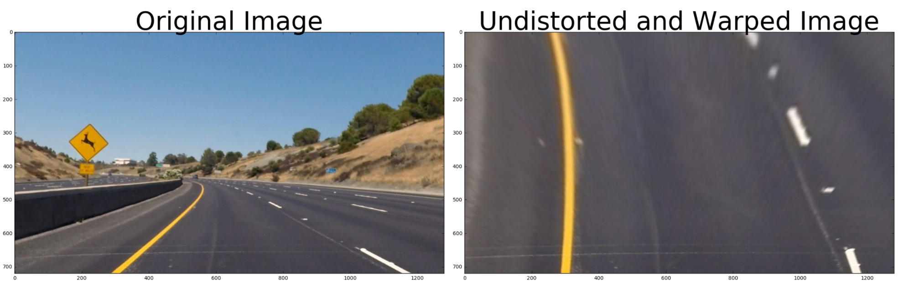
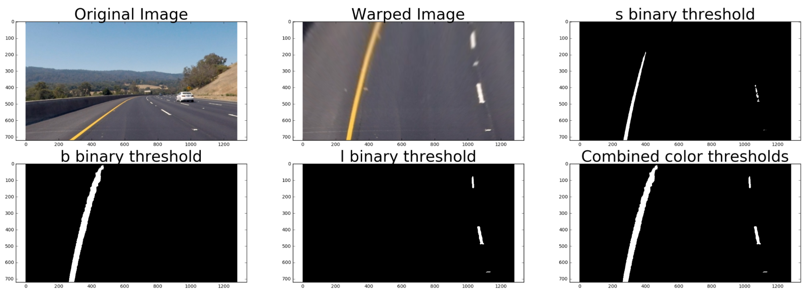
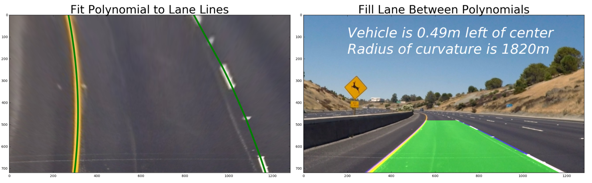
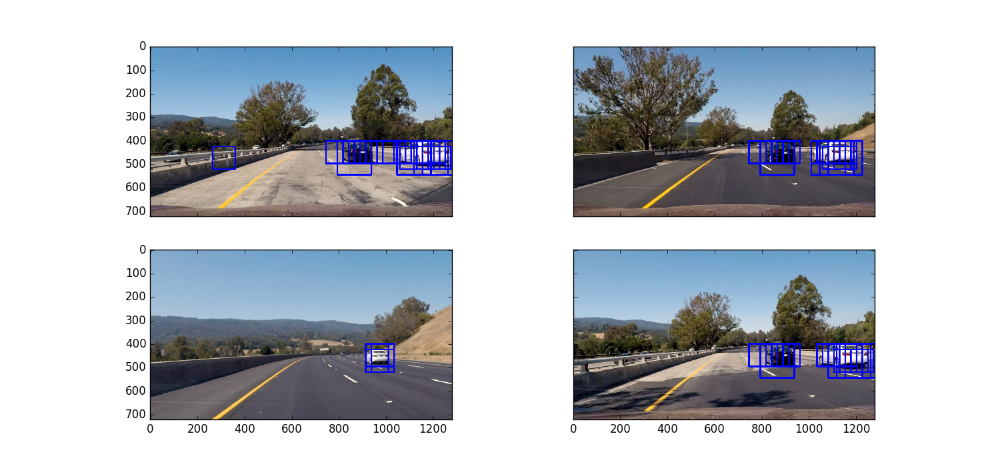
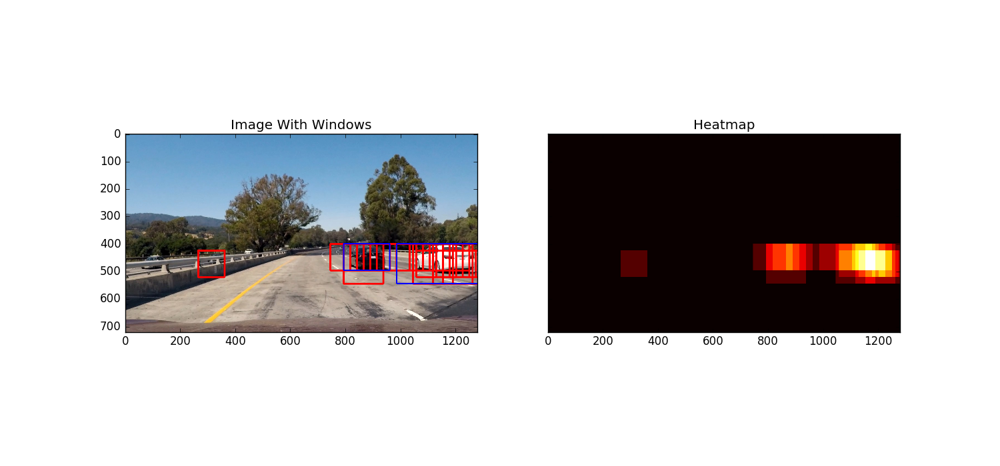

# Advanced Lane Finding with Vehicle Detection

The goal of this project is to develop a pipeline to process a video stream from a forward-facing camera mounted on the front of a car, and output an annotated video with the following features:
- Automated location of lane line positions
- Triangulation of the location of the vehicle relative to the center of the lane
- Calculation of the radius of curvature of the road
- Automated detection of car objects on the road with a placed bounding box

* 

The labeled data for vehicle and non-vehicle examples to train the vehicle detection classifier come from a combination of the [**GTI vehicle image database**](http://www.gti.ssr.upm.es/data/Vehicle_database.html), the [**KITTI vision benchmark suite**](http://www.cvlibs.net/datasets/kitti/), and examples extracted from the project video itself.

After extracting features from the dataset of positive and negative examples of vehicles, a SVM classifier was trained with 98.09% accuracy to predict whether a certain image was a car or not. 

The pipeline created for this project processes images in the following steps:
- Step 1: Apply distortion correction using a calculated camera calibration matrix and distortion coefficients.
- Step 2: Apply a perspective transformation to warp the image to a birds eye view perspective of the lane lines.
- Step 3: Apply color thresholds to create a binary image which isolates the pixels representing lane lines.
- Step 4: Identify the lane line pixels and fit polynomials to the lane boundaries.
- Step 5: Determine curvature of the lane and vehicle position with respect to center.
- Step 6: Warp the detected lane boundaries back onto the original image.
- Step 7: Output visual display of the lane boundaries and numerical estimation of lane curvature and vehicle position.
- Step 8: Load SVM classifier for vehicle detection and implement a 3-D sliding windows search on the video
- Step 9: Generate a heat map based on detected car windows and aggregate high intensity areas using a threshold. 

### Step 1: Distortion Correction
In this step, I used the OpenCV functions `findChessboardCorners` and `drawChessboardCorners` to identify the locations of corners on a series of pictures of a chessboard taken from different angles.

Next, the locations of the chessboard corners were used as input to the OpenCV function `calibrateCamera` to compute the camera calibration matrix and distortion coefficients. 

Finally, the camera calibration matrix and distortion coefficients were used with the OpenCV function `undistort` to remove distortion from highway driving images.

### Step 2: Perspective Transform
The goal of this step is to transform the undistorted image to a "birds eye view" of the road which focuses only on the lane lines and displays them in such a way that they appear to be relatively parallel to eachother (as opposed to the converging lines you would normally see). To achieve the perspective transformation I first applied the OpenCV functions `getPerspectiveTransform` and `warpPerspective` which take a matrix of four source points on the undistorted image and remaps them to four destination points on the warped image. The source and destination points were selected manually by visualizing the locations of the lane lines on a series of test images.

* 

### Step 3: Apply Binary Thresholds
In this step I attempted to convert the warped image to different color spaces and create binary thresholded images which highlight only the lane lines and ignore everything else. 
I found that the following color channels and thresholds did a good job of identifying the lane lines in the provided test images:
- The S Channel from the HLS color space, with a min threshold of 180 and a max threshold of 255, did a fairly good job of identifying both the white and yellow lane lines, but did not pick up 100% of the pixels in either one, and had a tendency to get distracted by shadows on the road.
- The L Channel from the LUV color space, with a min threshold of 225 and a max threshold of 255, did an almost perfect job of picking up the white lane lines, but completely ignored the yellow lines.
- The B channel from the Lab color space, with a min threshold of 155 and an upper threshold of 200, did a better job than the S channel in identifying the yellow lines, but completely ignored the white lines. 

I chose to create a combined binary threshold based on the three above mentioned binary thresholds, to create one combination thresholded image which does a great job of highlighting almost all of the white and yellow lane lines.

* 

### Steps 4: Fitting a polynomial to the lane lines, calculating vehicle position and radius of curvature:
At this point I was able to use the combined binary image to isolate only the pixels belonging to lane lines. The next step was to fit a polynomial to each lane line, which was done by:
- Identifying peaks in a histogram of the image to determine location of lane lines.
- Identifying all non zero pixels around histogram peaks using the numpy function `numpy.nonzero()`.
- Fitting a polynomial to each lane using the numpy function `numpy.polyfit()`.

After fitting the polynomials I was able to calculate the position of the vehicle with respect to center with the following calculations:
- Calculated the average of the x intercepts from each of the two polynomials `position = (rightx_int+leftx_int)/2`
- Calculated the distance from center by taking the absolute value of the vehicle position minus the halfway point along the horizontal axis `distance_from_center = abs(image_width/2 - position)`
- If the horizontal position of the car was greater than `image_width/2` than the car was considered to be left of center, otherwise right of center.
- Finally, the distance from center was converted from pixels to meters by multiplying the number of pixels by `3.7/700`.

Next I used the following code to calculate the radius of curvature for each lane line in meters:
```
ym_per_pix = 30./720 # meters per pixel in y dimension
xm_per_pix = 3.7/700 # meteres per pixel in x dimension
left_fit_cr = np.polyfit(lefty*ym_per_pix, leftx*xm_per_pix, 2)
right_fit_cr = np.polyfit(righty*ym_per_pix, rightx*xm_per_pix, 2)
left_curverad = ((1 + (2*left_fit_cr[0]*np.max(lefty) + left_fit_cr[1])**2)**1.5) \
                             /np.absolute(2*left_fit_cr[0])
right_curverad = ((1 + (2*right_fit_cr[0]*np.max(lefty) + right_fit_cr[1])**2)**1.5) \
                                /np.absolute(2*right_fit_cr[0])
```
*Source:* http://www.intmath.com/applications-differentiation/8-radius-curvature.php

The final radius of curvature was taken by average the left and right curve radiuses.

* 
---
### Step 5: Creating Features for SVM Classifier

Features used for the model consist of a spatial binning, a color histogram, HOG (Historgram of Oriented Gradient).

I used **YCrCb** color space for the features. All the images were first converted to **YCrCb** from **RGB** color space.

Spatial Binning of Color

The first part of the features is examining the raw pixel values of an image. The image from training data is resized to **16x16** and converted into a vector using **ravel()**.

*cv2.resize()* function from **OpenCV** library is used to resize the image.


Histograms of Color

We can infer information from an image through its colors. The color pixel values of an image provide important information that can help us to distinguish between vehicle and non-vehicle windows.

**YCrCb** contains **3** color channels. Histograms of pixels from each channel are constructed with bin size equals 32.


Histogram of Oriented Gradient (HOG)
A vehicle can be distinguished from a non-vehicle by through analysis of edge detection outputs. **HOG** will compute the gradients from blocks of cells to detect edges by the derivative of pixel value regions. Then, a histogram is constructed using these gradient values to detect edges.

I used **hog** function from **scikit-image**.

---
### Step 6: Constucting A Model

After extracting features from all data, I used a **SVM** classifier to train the features.

Before training the data, the data was normalized using **StandardScaler()** from **sklearn.preprocessing**.

The normalized data was then split into a training and testing set with 80% training and 20% testing ratios from the original dataset.
   
### The Best Set of Parameters  
After repeating this procedure many times with different sets of parameters, I found the set of parameters below worked the best.

- **Spatial Binning of Color**: size = (16, 16)
- **Histograms of Color**: nbins = 32
- **Histogram of Oriented Gradient (HOG)**: orient = 8, pix_per_cell = 8, cell_per_block = 2

---
### Step 7: Sliding Window Search
For the window search, I built a function that would scan through an image given inputs of desired window size and overlap between windows. Small windows would be initialized at the center and, as the size of windows gets larger, the closer to the bottom of the image the windows become. 

Different window sizes were used to examine cars at sizes given distance from the camera. I utilized 4 window scans -- with sizes of 96x96, 144x144, 192x192, and 192x192 with a small offset in starting position. The overlap would be set at 0.75 in order to allow multiple windows to validate that a car was present. 

* 


### Combining Windows With A Heatmap
When a car is detected, multiple boxes are drawn on the car, so I used a **heatmap** to combine boxes into a single box.

After the heatmap is created, windows are constructed arond the continuous nonzero areas. I found that those pixels are usually **false positives**.

**ndi.label** will find nonzero areas and label them starting from 1 and set the background as 0.

More details about a **label** function can be found [here](https://docs.scipy.org/doc/scipy-0.16.0/reference/generated/scipy.ndimage.measurements.label.html).

* 

### Step 8: Output visual display of the lane boundaries and numerical estimation of lane curvature and vehicle position.
The final step in processing the images was to plot the polynomials on to the warped image, fill the space between the polynomials to highlight the lane that the car is in, use another perspective trasformation to unwarp the image from birds eye back to its original perspective, and print the distance from center and radius of curvature on to the final annotated image.

## Video Processing Pipeline:
After establishing a pipeline to process still images, the final step was to expand the pipeline to process videos frame-by-frame, to simulate what it would be like to process an image stream in real time on an actual vehicle. 

My goal in developing a video processing pipeline was to create as smooth of an output as possible. To achieve this, I created a class for each of the left and right lane lines and stored features of each lane for averaging across frames.

The video pipeline first checks whether or not the lane was detected in the previous frame. If it was, then it only checks for lane pixels in close proximity to the polynomial calculated in the previous frame. This way, the pipeline does not need to scan the entire image, and the pixels detected have a high confidence of belonging to the lane line because they are based on the location of the lane in the previous frame. 

If at any time, the pipeline fails to detect lane pixels based on the the previous frame, it will go back in to blind search mode and scan the entire binary image for nonzero pixels to represent the lanes.

In order to make the output smooth I chose to average the coefficients of the polynomials for each lane line over a span of 10 frames. The gif below is the result of my pipeline running on the test video provided for the project, as well as an  optional challenge video which presented additional challenges to the lane detection pipeline.

The overall performance of the model does a fair job at identifying obvious examples of cars frame-by-frame without false positives; however, there are some cases when the model does not detect the car from an image, which results in no boxes drawn on the image. I implemented an algorithm that uses the windows data from previous frames to predict the location of the windows if the model fails to draw rectangles on cars.

The class Window contains an array **probability**. This array is initialized by **initialize_center_box** function.

Each item in the array contains 5 values.
1. center: x and y coordinates of a center of a box
2. width: A width of a box
3. height: A height of a box
4. move: Changes in x values and y values of a center of a box
5. prob: This is the confidence level of the box. If the value is high then it will be likely that the box should be drawn even if the model does not detect anything in that area.

Then **average_boxes** function is used to compare new windows from current frame and old windows from previous frames. Confidence level is an arbitrary metric that is incremented when a similar window in terms of image pixel location is found. Only if the boxes with high confidence value wil be drawn -- for this project, the threshold was chosen as 15. 

### Possible Limitations:
The video pipeline developed in this project did a fairly robust job of detecting the lane lines in the test video provided for the project, which shows a road in basically ideal conditions, with fairly distinct lane lines, and on a clear day. It also did a decent job with the challenge video, although it did lose the lane lines momentarily when there was heavy shadow over the road from an overpass. 

What I have learned from this project is that it is relatively easy to finetune a software pipeline to work well for consistent road and weather conditions, but what is challenging is finding a single combination which produces the same quality result in any condition. I have not yet tested the pipeline on additional video streams which could challenge the pipeline with varying lighting and weather conditions, road quality, faded lane lines, and different types of driving like lane shifts, passing, and exiting a highway. For further research I plan to record some additional video streams of my own driving in various conditions and continue to refine my pipeline to work in more varied environments.    
The video demonstrates that the model is able to distinguish between the road and vehicles relatively well. The other side of the road for oncoming traffic was able to detect a few images, but I believe that the obscuring barrier and random objects such as trees prevented better success. There was a noticed false positive that could be filtered out with better false positive checks or with a better trained model -- the SVM classifier still had about ~2% in errors. More training data would likely help, as well as data that can identify obscured vehicles on the other side of the road as well. 

The model would likely benefit from techniques used in the last project for detecting lane lines when distinguishing between multiple vehicles. I noticed that the bounding boxes aggregated when vehicles were close to each other -- some sort of edge detection should be used in order to separate them into distinct bounding boxes. 
